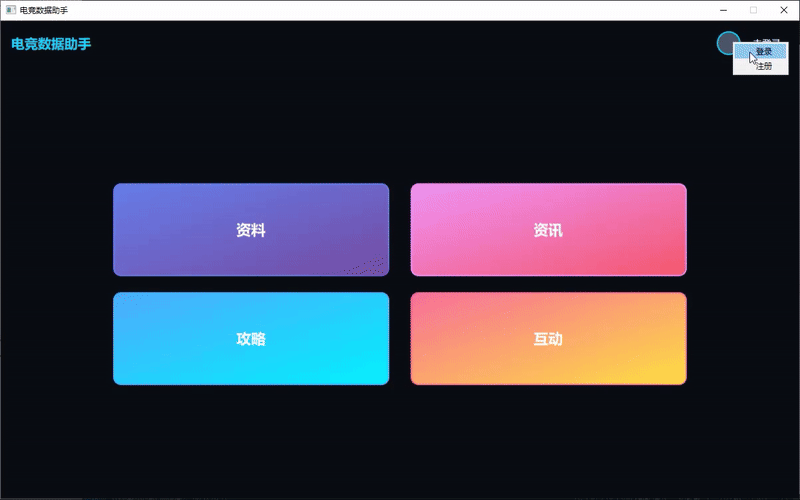
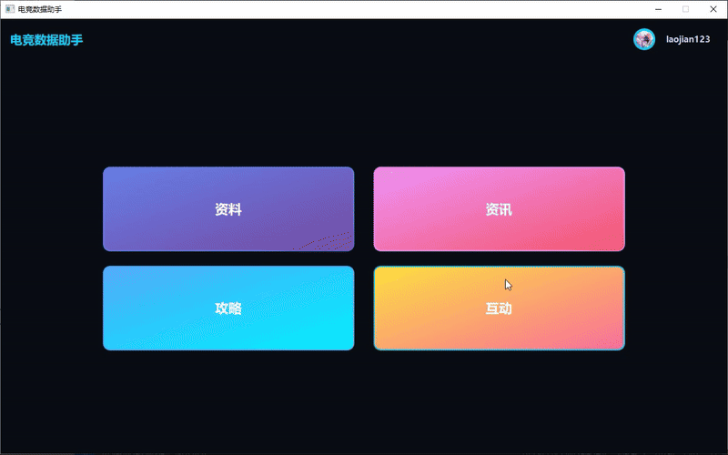

# TinyLeagueBox联盟攻略与话题评分平台

C++/Qt 客户端 + Python/FastAPI 后端的迷你联盟盒子（桌面应用程序），支持账户管理、资料讯息的浏览和话题评论社区。

# 功能概述
## 账户管理与头像上传
- **用户注册登录**: 安全的用户名密码认证机制
- **头像管理系统**: 
  - 支持PNG/JPG格式图片上传
  - 自动裁剪压缩至200×200像素
  - 客户端本地缓存优化



## 英雄资料查询系统
- **资料库功能**:
  - 完整英雄列表浏览
  - 详细信息查询界面
- **智能筛选系统**:
  - 按职业筛选: 法师/坦克/战士/刺客/射手
  - 按分路筛选: 上单/中单/下路/打野/辅助
- **详细信息展示**:
  - 英雄原画与背景故事
  - 能力五维图可视化
  - 英雄定位与难度评级
  - 技能详情与皮肤展示

 

## 社区互动板块
- **话题讨论系统**:
  - 虎扑式社区互动模式
  - 多话题分类讨论
  - 示例: "版本热门英雄评分"话题
- **互动功能**:
  - 五星评分系统(0-5星)
  - 50字以内短评功能
  - AI智能内容审核
- **实时数据展示**:
  - 评分平均值统计
  - 参与人数显示
  - 最新评论实时更新



## 项目结构

```
5QGGIGUM6WQ2/
├── app/                     # Qt 客户端
│   ├── components/          # UI 组件
│   │   ├── authdialog.*     # 登录注册对话框
│   │   ├── avatarwidget.*   # 头像上传组件
│   │   ├── herocardwidget.* # 英雄卡片组件
│   │   └── ...
│   ├── network/
│   │   └── httpclient.*     # HTTP 请求封装
│   ├── widget.*             # 主窗口
│   └── 5QGGIGUM6WQ2.pro     # Qt 项目文件
├── backend/                 # FastAPI 后端
│   ├── routes/              # API 路由
│   │   ├── auth.py          # 认证接口
│   │   ├── heroes.py        # 英雄数据接口
│   │   └── ratings.py       # 评分接口
│   ├── static/              # 静态资源
│   │   ├── hero_squares/    # 英雄头像
│   │   ├── hero_skin/       # 英雄皮肤
│   │   └── skill_img/       # 技能图标
│   ├── models.py            # 数据模型
│   ├── app.py               # 服务入口
│   └── requirements.txt     # Python 依赖
```


# 技术实现
## 账户模块
### 用户注册/登录
- **注册**：用户名+密码，密码加盐哈希存储
- **登录**：返回 JWT token、用户名、头像地址
- **认证**：使用 Bearer token 验证身份
### 头像系统
- 支持上传图片文件（PNG/JPG），自动压缩至 200x200
- 文件存储在 `backend/static/avatars/` 
- 命名格式：`{user_id}_{uuid}.png`
- 客户端自动下载并缓存头像
### 技术实现
- **后端**：argon2 密码哈希 + JWT 认证
- **前端**：Qt Network 模块处理 HTTP 请求，QSettings 持久化登录状态
- **安全**：参数化查询防 SQL 注入，token 过期自动重定向登录

## 资料查询模块
### 数据架构
- 数据库设计：使用 PostgreSQL 存储英雄数据，建立完善的索引优化查询性能
- 数据模型：设计规范的英雄数据模型，包含技能、皮肤、属性等多维数据
- API 设计：RESTful API 接口，支持分页、筛选和排序参数
### 前端技术
- 数据可视化：使用 Qt 的 QPainter 绘制五维属性雷达图
- 异步加载：实现英雄列表和详情的异步加载，保证UI流畅性
- 本地缓存：对静态资源（英雄头像、技能图标）进行本地缓存管理

## 互动板块
### 评分/评论系统
- **业务逻辑**：后端实现唯一性约束，确保每用户每英雄每话题仅一条评分
- **输入验证**：严格的评论内容验证（50字内，仅支持字母数字中文空格）
- **实时计算**：评分平均值实时计算，采用数据库聚合函数保证准确性
- **内容审核**：集成 OpenAI API 对用户评论进行智能内容审核
- **实时更新**：前端实现提交后自动刷新机制，保持数据一致性

### 性能优化
- **数据库索引**：对常用查询字段（英雄ID、用户ID、话题类型）建立复合索引
- **API 优化**：采用分页技术处理显示大量数据查询
- **前端渲染**：使用 Qt 的信号槽机制实现异步数据更新，避免UI阻塞


## 构建说明

### CMake + MSVC 构建

由于项目使用 Qt6，推荐通过 Qt Creator 配置 MSVC 工具链：

#### 环境准备
1. 安装 Visual Studio 2019/2022（含 MSVC 编译器）
2. 安装 Qt 6.x（选择 MSVC 版本）
3. 安装 Qt Creator

#### 构建步骤
```cmd
# 1. 设置环境变量
set QTDIR=C:\Qt\6.9.1\msvc2019_64
set PATH=%QTDIR%\bin;%PATH%

# 2. 配置构建目录
cd app
mkdir build && cd build

# 3. 生成 Visual Studio 项目
qmake ../5QGGIGUM6WQ2.pro -spec win32-msvc

# 4. 使用 MSVC 编译
nmake
```

#### Qt Creator 配置
1. **打开项目**：选择 `app/5QGGIGUM6WQ2.pro`
2. **配置 Kit**：
   - 编译器：Microsoft Visual C++ Compiler
   - Qt 版本：6.x MSVC
   - CMake：使用系统 CMake 或 Qt 自带版本
3. **构建设置**：
   - 构建目录：`build/Release` 或 `build/Debug`
   - 构建步骤：qmake + make/nmake
4. **运行配置**：确保可执行文件路径正确

#### 常见配置问题
- **找不到 MSVC**：检查 Visual Studio 安装，确保选择了 C++ 工作负载
- **Qt 版本不匹配**：在 Qt Creator 的 `工具 > 选项 > Qt Versions` 中添加正确路径
- **依赖库缺失**：使用 `windeployqt` 部署运行时库：
  ```cmd
  windeployqt.exe --debug 5QGGIGUM6WQ2.exe
  ```

### 后端部署
```bash
cd backend
pip install -r requirements.txt


uvicorn app:app --host 127.0.0.1 --port 8000
```

## API 接口

| 端点 | 方法 | 功能 |
|------|------|------|
| `/api/auth/register` | POST | 用户注册 |
| `/api/auth/login` | POST | 用户登录 |
| `/api/auth/profile` | GET | 获取用户信息 |
| `/api/auth/avatar` | POST | 上传头像 |
| `/api/heroes` | GET | 英雄列表 |
| `/api/heroes/{id}` | GET | 英雄详情 |
| `/api/ratings` | POST | 提交评分 |
| `/api/ratings/{hero_id}` | GET | 获取评分列表 |

